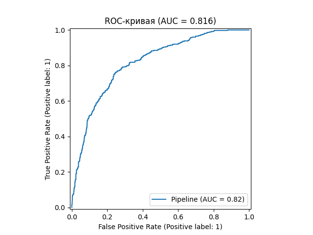
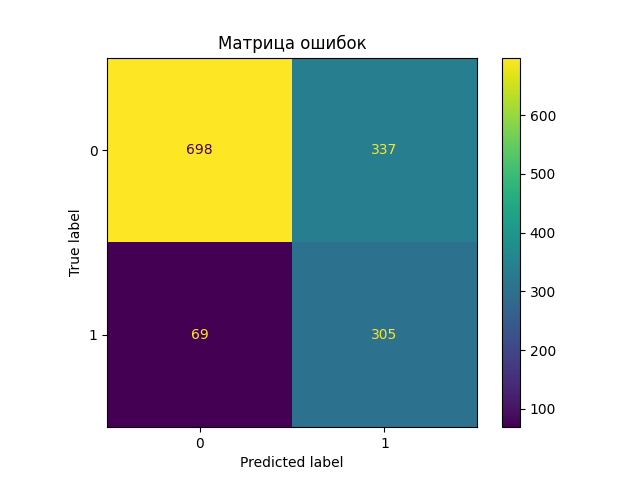
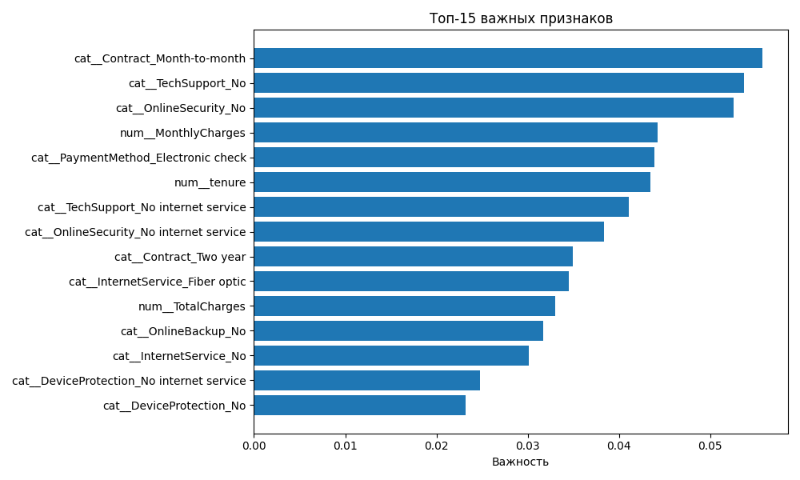

# Автоматизированный ML-пайплайн прогнозирования оттока клиентов телеком-оператора

## 📝 Описание проекта

В проекте реализован автоматизированный ML-пайплайн с автоматическим подбором гиперпараметров модели Random Forest.

Цель проекта — построение модели машинного обучения, способной прогнозировать вероятность оттока клиента на основе информации о его тарифе, услугах и истории обслуживания.

### 💼 Бизнес-задача

Компаниям телекоммуникационной отрасли важно своевременно выявлять клиентов, которые могут отказаться от услуг оператора связи. Потеря клиентов приводит к снижению выручки и увеличению затрат на привлечение новых пользователей.

Полученные прогнозы могут использоваться для проведения маркетинговых кампаний по удержанию клиентов и повышения лояльности пользователей.

## :books: Структура пайплайна

1. Загрузка данных.
2. Очистка и подготовка данных.
3. Кодирование категориальных признаков.
4. Масштабирование числовых признаков.
5. Обучение модели.
6. Оценка качества.
7. Сохранение модели.
8. Мониторинг метрик.

## :bookmark_tabs: Датасет

Используется открытый набор данных IBM Telco Customer Churn.

Данный датасет выбран как отраслевой аналог данных телекоммуникационного оператора и применяется исключительно в учебных целях для демонстрации построения ML-пайплайна прогнозирования оттока клиентов.

## 🔧 ETL-процесс

### Extract

Загрузка данных из файла Telco-Customer-Churn.csv с использованием библиотеки Pandas.

### Transform

На этапе преобразования данных выполняются:

1. преобразование признака TotalCharges в числовой формат;
2. обработка пропущенных значений;
3. стандартизация числовых признаков с использованием StandardScaler;
4. кодирование категориальных признаков методом One-Hot Encoding.

### Load

После обучения модель с использованием библиотеки Joblib сохраняется в файл: models/churn_model.pkl

## 🤖 Архитектура ML-модели

Для прогнозирования оттока клиентов используется алгоритм Random Forest Classifier.

Параметры модели:

- n_estimators = 200
- max_depth = 6
- class_weight = balanced
- random_state = 42

Модель обучается внутри Scikit-learn Pipeline, включающего этапы предобработки данных и классификации.

Использование параметра class_weight="balanced" позволяет учитывать дисбаланс классов в исходном наборе данных.

## :triangular_ruler: Используемые технологии

* Python
* Pandas
* Scikit-learn
* MLflow (подготовлена интеграция, временно отключена)
* Docker
* GitHub Actions
* Pytest

## :rocket: Запуск проекта

Установка зависимостей:

pip install -r requirements.txt

Запуск:

python pipeline.py

## :globe_with_meridians: Запуск через Docker

docker build -t churn-pipeline .

docker run --rm churn-pipeline

## :mag: Тестирование

Для проверки корректности работы пайплайна используются автоматизированные тесты на базе Pytest.

Реализованы следующие проверки:

- успешная загрузка датасета;
- наличие целевого признака Churn;
- корректность распределения классов;
- качество модели по метрике ROC-AUC.

Запуск тестов: tests/test_pipeline.py

## :monocle_face: CI/CD

GitHub Actions автоматически запускает тестирование и сборку Docker-образа при каждом push в ветку main.

## :technologist: Мониторинг

После каждого запуска пайплайна автоматически сохраняются основные метрики качества модели:

- Accuracy;
- F1-score;
- ROC-AUC;
- время обучения модели.

Метрики записываются в файл monitoring/metrics.json в формате JSON для последующего анализа и сравнения результатов между запусками.

## :lock: Ограничения проекта

Используется открытый учебный датасет. Для внедрения в конкретной компании требуется переобучение модели на внутренних данных организации.

## 📊 Визуализация результатов

### ROC-кривая

Показывает способность модели разделять клиентов, склонных и не склонных к оттоку.

### Матрица ошибок

Отображает количество верно и неверно классифицированных объектов.

### Важность признаков

Позволяет определить факторы, наиболее влияющие на вероятность оттока клиента.

## :sparkles: Результаты модели

| Метрика | Значение |
|----------|----------|
| Accuracy | 0.712    |
| F1-score | 0.600    |
| ROC-AUC | 0.816    |

Значение ROC-AUC = 0.814 свидетельствует о хорошей способности модели различать клиентов, склонных и не склонных к оттоку.

Значение F1-score = 0.594 показывает приемлемый баланс между полнотой и точностью выявления клиентов с высоким риском ухода.

Модель успешно выявляет клиентов с высоким риском оттока и может использоваться как демонстрационный пример автоматизированного ML-пайплайна.

Полученные результаты подтверждают возможность применения модели в качестве инструмента поддержки принятия решений в задачах удержания клиентов.